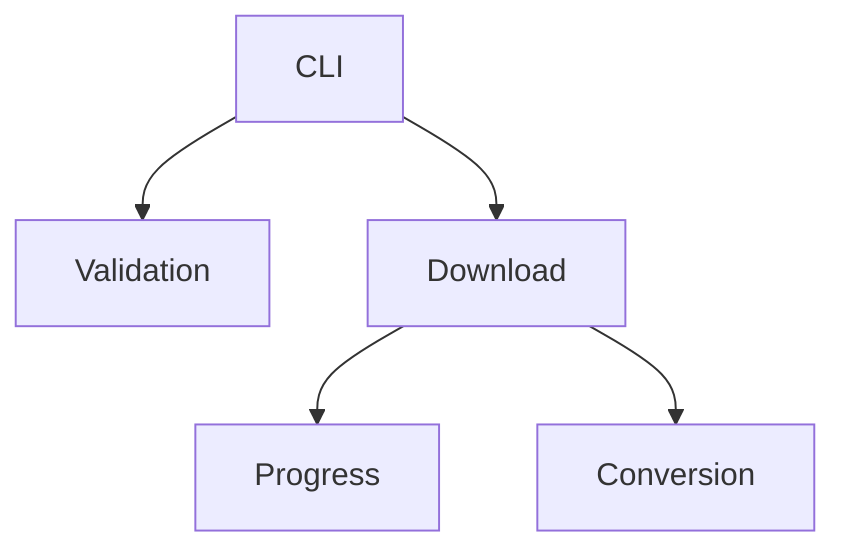

# Project Agents

This document describes the main agents that make up the **Program Youtube Downloader**.
Each agent groups related functions and responsibilities.

## CLI Agent
**Purpose**: Provide the command line interface and dispatch user choices.

**Entry point**: `main()` in [main.py](main.py) lines 11-70.

**Inputs**: user selections from the menu.

**Outputs**: invokes download functions and terminates when the user chooses to quit.

**Dependencies**: `youtube_downloader` module.

Usage:
```python
from main import main
main()
```

## Download Agent
**Purpose**: Fetch videos or audios from YouTube and manage download workflows.**

**Entry point**: `download_multiple_videos()` in [youtube_downloader.py](youtube_downloader.py) lines 282-383.

**Inputs**: list of YouTube URLs (or Playlist/Channel), boolean `download_sound_only`.

**Outputs**: video or audio files saved to disk.

**Dependencies**: `pytubefix`, validation helpers and progress agent.

Usage:
```python
from youtube_downloader import download_multiple_videos
urls = ["https://www.youtube.com/watch?v=dQw4w9WgXcQ"]
download_multiple_videos(urls, False)
```

## Conversion Agent
**Purpose**: Convert a downloaded mp4 file to mp3.**

**Entry point**: `conversion_mp4_in_mp3()` in [youtube_downloader.py](youtube_downloader.py) lines 267-279.

**Inputs**: path to the downloaded mp4 file.

**Outputs**: an mp3 file saved to disk, old mp4 removed.

Usage:
```python
from youtube_downloader import conversion_mp4_in_mp3
conversion_mp4_in_mp3("video.mp4")
```

## Progress Agent
**Purpose**: Display progress information while downloads are running.**

**Entry points**:
- `on_download_progress()` in [youtube_downloader.py](youtube_downloader.py) lines 174-183.
- `progress_bar()` in [youtube_downloader.py](youtube_downloader.py) lines 186-208.

**Inputs**: stream callbacks from `pytubefix`, progress percentages.

**Outputs**: textual progress bar in the console.

Usage:
```python
# automatically used via download_multiple_videos
```

## Validation Agent
**Purpose**: Validate user input and sanitize values.**

**Entry points**:
- `demander_valeur_numerique_utilisateur()` in [youtube_downloader.py](youtube_downloader.py) lines 65-78.
- `demander_url_vidéo_youtube()` in [youtube_downloader.py](youtube_downloader.py) lines 112-125.
- `demander_youtube_link_file()` in [youtube_downloader.py](youtube_downloader.py) lines 128-171.

**Inputs**: values typed by the user.

**Outputs**: validated and sanitized inputs.

Usage:
```python
from youtube_downloader import demander_valeur_numerique_utilisateur
choice = demander_valeur_numerique_utilisateur(1, 3)
```

## Summary

| Agent | File(s) | Main Functions |
|-------|---------|----------------|
| CLI Agent | `main.py` | `main()` |
| Download Agent | `youtube_downloader.py` | `download_multiple_videos` |
| Conversion Agent | `youtube_downloader.py` | `conversion_mp4_in_mp3` |
| Progress Agent | `youtube_downloader.py` | `on_download_progress`, `progress_bar` |
| Validation Agent | `youtube_downloader.py` | `demander_valeur_numerique_utilisateur`, `demander_url_vidéo_youtube`, `demander_youtube_link_file` |

## Interaction Diagram


## Best Practices
- Keep agents small and focused on a single responsibility.
- Keep each agent self-contained with clear input/output.
- Expose a minimal API to other modules.
- Reuse type hints consistently (see current use of `typing` and `Optional` in `youtube_downloader.py`).
- When adding features, favor extending an existing agent rather than duplicating logic.
- Write tests for new behaviour in `tests/` using `pytest`.

## Adding a new agent
1. Create a module or function group implementing the new behaviour.
2. Document it in **AGENTS.md** with its purpose, entry points and usage.
   - Update the summary table and extend the mermaid diagram.
3. Provide unit tests demonstrating its interactions with existing agents.
4. Link any new documentation from the README.

