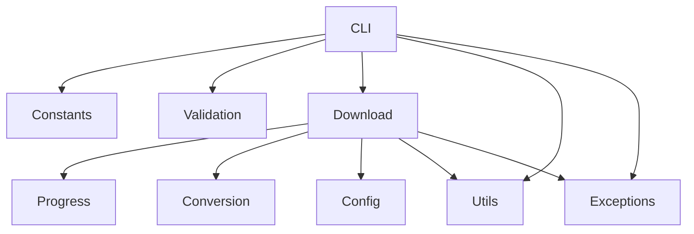

# Agents du projet

Ce document décrit les principaux agents qui composent **Program Youtube Downloader**.
Chaque agent regroupe des fonctions et responsabilités associées.

## Agent CLI
**Rôle** : Fournir l'interface en ligne de commande et dispatcher les choix de l'utilisateur.**

- `main()` dans [program_youtube_downloader/main.py](program_youtube_downloader/main.py) pour le lancement général.
- Classe `CLI` dans [program_youtube_downloader/cli.py](program_youtube_downloader/cli.py) pour la gestion du menu et des sous-commandes.

**Entrées** : arguments de la ligne de commande ou sélections depuis le menu.

**Sorties** : appelle les fonctions de téléchargement et se termine quand l'utilisateur choisit de quitter.

**Dépendances** : module `legacy_utils`. Les libellés du menu sont définis dans
[`constants.py`](program_youtube_downloader/constants.py).

Utilisation :
```python
from program_youtube_downloader.main import main
main()
```

## Agent de téléchargement
**Rôle** : Récupérer des vidéos ou des pistes audio depuis YouTube et gérer les flux de téléchargement.

**Point d'entrée** : `download_multiple_videos()` dans [downloader.py](downloader.py).

**Entrées** : liste d'URLs YouTube (ou Playlist/Chaîne), booléen `download_sound_only`.

**Sorties** : fichiers vidéo ou audio enregistrés sur le disque.

**Dépendances** : `pytubefix`, fonctions de validation et agent de progression.

`YoutubeDownloader` accepte facultativement une fabrique `youtube_cls` pour créer des
objets `pytubefix.YouTube`. Les tests peuvent fournir un constructeur factice pour éviter
l'accès réseau.

Utilisation :
```python
from downloader import YoutubeDownloader
urls = ["https://www.youtube.com/watch?v=dQw4w9WgXcQ"]
yd = YoutubeDownloader()
yd.download_multiple_videos(urls, False)
```

## Agent de conversion
**Rôle** : Convertir un fichier mp4 téléchargé en mp3.

**Point d'entrée** : `conversion_mp4_in_mp3()` dans [downloader.py](downloader.py).

**Entrées** : chemin vers le fichier mp4 téléchargé.

**Sorties** : fichier mp3 enregistré sur le disque, ancien mp4 supprimé.

Utilisation :
```python
from downloader import YoutubeDownloader
yd = YoutubeDownloader()
yd.conversion_mp4_in_mp3("video.mp4")
```

## Agent de progression
**Rôle** : Afficher les informations d'avancement pendant les téléchargements.

**Points d'entrée** :
- `on_download_progress()` dans [program_youtube_downloader/progress.py](program_youtube_downloader/progress.py).
- `progress_bar()` dans [program_youtube_downloader/progress.py](program_youtube_downloader/progress.py).
- Dataclass `ProgressOptions` pour personnaliser l'affichage.
- Classes `ProgressBarHandler` et `VerboseProgressHandler` implémentant `ProgressHandler`.

**Entrées** : rappels de flux provenant de `pytubefix`, pourcentages d'avancement.

**Sorties** : barre de progression textuelle dans la console ou simple pourcentage.

Utilisation :
```python
# automatically used via download_multiple_videos
```

## Agent de validation
**Rôle** : Valider les entrées utilisateur et les nettoyer.

**Points d'entrée** :
- `ask_numeric_value()` dans [program_youtube_downloader/cli_utils.py](program_youtube_downloader/cli_utils.py).
- `ask_youtube_url()` dans [program_youtube_downloader/cli_utils.py](program_youtube_downloader/cli_utils.py).
- `ask_youtube_link_file()` dans [program_youtube_downloader/cli_utils.py](program_youtube_downloader/cli_utils.py).
- `validate_youtube_url()` dans [program_youtube_downloader/validators.py](program_youtube_downloader/validators.py).

**Entrées** : valeurs saisies par l'utilisateur.

**Sorties** : entrées validées et nettoyées à l'aide de `BASE_YOUTUBE_URL` depuis [`constants.py`](program_youtube_downloader/constants.py).

Utilisation :
```python
from program_youtube_downloader.cli_utils import ask_numeric_value
value = ask_numeric_value(1, 3)
```

## Agent utilitaires
**Rôle** : Fournir des fonctions d'affichage diverses utilisées dans la CLI et les tests.

**Point d'entrée** : [program_youtube_downloader/utils.py](program_youtube_downloader/utils.py)

**Fonctions** :
- `clear_screen()` pour effacer la console selon le système.
- `program_break_time()` pour afficher un compte à rebours textuel.

## Agent des exceptions
**Rôle** : Centraliser les classes d'erreur spécifiques au projet.

**Point d'entrée** : [program_youtube_downloader/exceptions.py](program_youtube_downloader/exceptions.py)

**Exceptions principales** :
- `PydlError` comme classe de base commune.
- `DownloadError`, `ValidationError` pour les erreurs génériques.
- `PlaylistConnectionError`, `ChannelConnectionError` pour les problèmes d'accès.
- `StreamAccessError`, `DirectoryCreationError`, `InvalidURLError` pour les cas particuliers.

## Résumé

| Agent | Fichier(s) | Fonctions principales |
|-------|------------|----------------------|
| Agent CLI | `program_youtube_downloader/main.py`, `program_youtube_downloader/cli.py` | `setup_logging`, `parse_args`, `main()`, classe `CLI` |
| Agent de téléchargement | `downloader.py` | `download_multiple_videos` |
| Agent de conversion | `downloader.py` | `conversion_mp4_in_mp3` |
| Agent de progression | `program_youtube_downloader/progress.py` | `on_download_progress`, `progress_bar`, `ProgressOptions`, `ProgressBarHandler`, `VerboseProgressHandler` |
| Agent de validation | `program_youtube_downloader/cli_utils.py` | `ask_numeric_value`, `ask_youtube_url`, `ask_youtube_link_file` |
| Agent des constantes | `program_youtube_downloader/constants.py` | libellés du menu, `BASE_YOUTUBE_URL` |
| Agent de configuration | `program_youtube_downloader/config.py` | dataclass `DownloadOptions` |
| Agent utilitaires | `program_youtube_downloader/utils.py` | `clear_screen`, `program_break_time` |
| Agent des exceptions | `program_youtube_downloader/exceptions.py` | classes d'erreurs |

## Diagramme d'interaction

## Séquence des opérations
1. **Agent CLI** affiche le menu grâce aux chaînes de l'**Agent des constantes** et récupère le choix de l'utilisateur.
2. L'**Agent de validation** vérifie que chaque valeur ou URL saisie est correcte.
3. L'**Agent CLI** construit un objet **DownloadOptions** de l'**Agent de configuration** puis appelle l'**Agent de téléchargement**.
4. Pendant le téléchargement, l'**Agent de téléchargement** envoie les mises à jour à l'**Agent de progression**.
5. Une fois le fichier vidéo téléchargé, l'**Agent de conversion** peut le convertir en MP3 si l'option audio seul est activée.

## Bonnes pratiques
- Garder les agents petits et concentrés sur une seule responsabilité.
- Chaque agent doit être autonome avec des entrées/sorties claires.
- Exposer une API minimale aux autres modules.
- Réutiliser systématiquement les hints de type (voir l'utilisation actuelle de `typing` et `Optional` dans `legacy_utils.py`).
- Lorsqu'on ajoute des fonctionnalités, privilégier l'extension d'un agent existant plutôt que la duplication de logique.
- Écrire des tests pour tout nouveau comportement dans `tests/` avec `pytest`.

## Ajouter un nouvel agent
1. Créer un module ou un groupe de fonctions implémentant le nouveau comportement.
2. Le documenter dans **AGENTS.md** en précisant son rôle, ses points d'entrée et son utilisation.
   - Mettre à jour le tableau récapitulatif et étendre le diagramme mermaid.
3. Fournir des tests unitaires démontrant ses interactions avec les agents existants.
4. Lier toute nouvelle documentation depuis le README.

