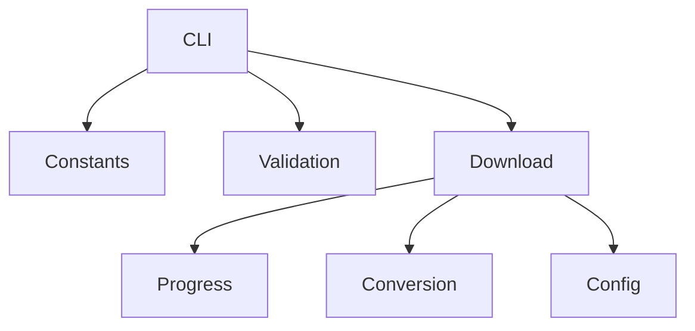

# Project Agents

This document describes the main agents that make up the **Program Youtube Downloader**.
Each agent groups related functions and responsibilities.

## CLI Agent
**Purpose**: Provide the command line interface and dispatch user choices.

**Entry point**: `main()` in [main.py](main.py) lines 128-150.

**Inputs**: command-line arguments or user selections from the menu.

**Outputs**: invokes download functions and terminates when the user chooses to quit.

**Dependencies**: `youtube_downloader` module. Menu labels are defined in
[`constants.py`](program_youtube_downloader/constants.py).

Usage:
```python
from main import main
main()
```

## Download Agent
**Purpose**: Fetch videos or audios from YouTube and manage download workflows.**

**Entry point**: `download_multiple_videos()` in [downloader.py](downloader.py) lines 62-153.

**Inputs**: list of YouTube URLs (or Playlist/Channel), boolean `download_sound_only`.

**Outputs**: video or audio files saved to disk.

**Dependencies**: `pytubefix`, validation helpers and progress agent.

`YoutubeDownloader` accepts an optional `youtube_cls` factory to create
`pytubefix.YouTube` objects. Tests can supply a dummy constructor to avoid
network access.

Usage:
```python
from downloader import YoutubeDownloader
urls = ["https://www.youtube.com/watch?v=dQw4w9WgXcQ"]
yd = YoutubeDownloader()
yd.download_multiple_videos(urls, False)
```

## Conversion Agent
**Purpose**: Convert a downloaded mp4 file to mp3.**

**Entry point**: `conversion_mp4_in_mp3()` in [downloader.py](downloader.py) lines 57-67.

**Inputs**: path to the downloaded mp4 file.

**Outputs**: an mp3 file saved to disk, old mp4 removed.

Usage:
```python
from downloader import YoutubeDownloader
yd = YoutubeDownloader()
yd.conversion_mp4_in_mp3("video.mp4")
```

## Progress Agent
**Purpose**: Display progress information while downloads are running.**

**Entry points**:
- `on_download_progress()` in [program_youtube_downloader/progress.py](program_youtube_downloader/progress.py) lines 8-13.
- `progress_bar()` in [program_youtube_downloader/progress.py](program_youtube_downloader/progress.py) lines 16-37.

**Inputs**: stream callbacks from `pytubefix`, progress percentages.

**Outputs**: textual progress bar in the console.

Usage:
```python
# automatically used via download_multiple_videos
```

## Validation Agent
**Purpose**: Validate user input and sanitize values.**

**Entry points**:
- `ask_numeric_value()` in [program_youtube_downloader/cli_utils.py](program_youtube_downloader/cli_utils.py) lines 22-39.
- `ask_youtube_url()` in [program_youtube_downloader/cli_utils.py](program_youtube_downloader/cli_utils.py) lines 96-113.
- `demander_youtube_link_file()` in [program_youtube_downloader/cli_utils.py](program_youtube_downloader/cli_utils.py) lines 115-159.
- `validate_youtube_url()` in [program_youtube_downloader/validators.py](program_youtube_downloader/validators.py) lines 4-18.

**Inputs**: values typed by the user.

**Outputs**: validated and sanitized inputs using `BASE_YOUTUBE_URL` from [`constants.py`](program_youtube_downloader/constants.py).

Usage:
```python
from program_youtube_downloader.cli_utils import ask_numeric_value
value = ask_numeric_value(1, 3)
```

## Summary

| Agent | File(s) | Main Functions |
|-------|---------|----------------|
| CLI Agent | `main.py` | `main()` |
| Download Agent | `downloader.py` | `download_multiple_videos` |
| Conversion Agent | `downloader.py` | `conversion_mp4_in_mp3` |
| Progress Agent | `program_youtube_downloader/progress.py` | `on_download_progress`, `progress_bar` |
| Validation Agent | `program_youtube_downloader/cli_utils.py` | `ask_numeric_value`, `ask_youtube_url`, `demander_youtube_link_file` |
| Constants Agent | `program_youtube_downloader/constants.py` | menu labels, `BASE_YOUTUBE_URL` |
| Config Agent | `program_youtube_downloader/config.py` | `DownloadOptions` dataclass |

## Interaction Diagram

## Sequence of Operations
1. **CLI Agent** affiche le menu grâce aux chaînes du **Constants Agent** et récupère le choix de l'utilisateur.
2. Le **Validation Agent** vérifie que chaque valeur ou URL saisie est correcte.
3. Le **CLI Agent** construit un objet **DownloadOptions** du **Config Agent** puis appelle le **Download Agent**.
4. Pendant le téléchargement, le **Download Agent** envoie les mises à jour au **Progress Agent**.
5. Une fois le fichier vidéo téléchargé, le **Conversion Agent** peut le convertir en MP3 si l'option audio seul est activée.

## Best Practices
- Keep agents small and focused on a single responsibility.
- Keep each agent self-contained with clear input/output.
- Expose a minimal API to other modules.
- Reuse type hints consistently (see current use of `typing` and `Optional` in `youtube_downloader.py`).
- When adding features, favor extending an existing agent rather than duplicating logic.
- Write tests for new behaviour in `tests/` using `pytest`.

## Adding a new agent
1. Create a module or function group implementing the new behaviour.
2. Document it in **AGENTS.md** with its purpose, entry points and usage.
   - Update the summary table and extend the mermaid diagram.
3. Provide unit tests demonstrating its interactions with existing agents.
4. Link any new documentation from the README.

