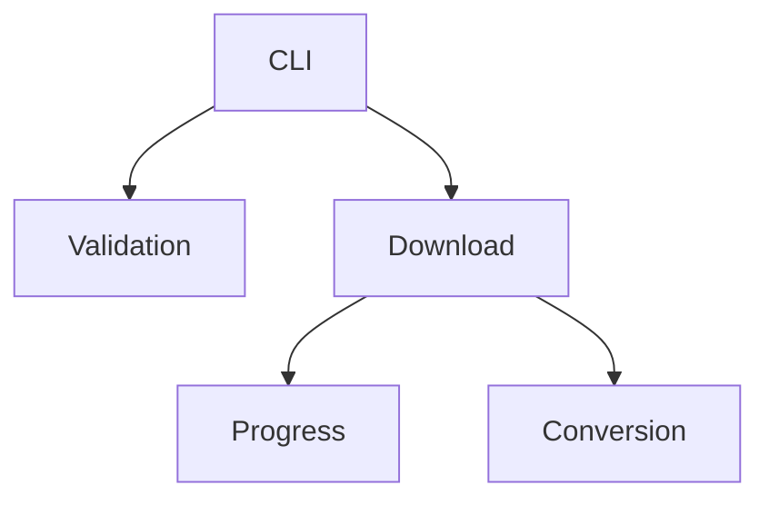

# Agents du projet

Ce document décrit les principaux agents composant **Program Youtube Downloader**.
Chaque agent regroupe des fonctions et responsabilités liées.

## Agent CLI
**But** : fournir l'interface en ligne de commande et dispatcher les choix de l'utilisateur.

**Point d'entrée** : `main()` dans [main.py](main.py) lignes 11-70.

**Entrées** : sélections de l'utilisateur dans le menu.

**Sorties** : appelle les fonctions de téléchargement puis se termine lorsque l'utilisateur choisit de quitter.

**Dépendances** : module `youtube_downloader`.

Utilisation :
```python
from main import main
main()
```

## Agent de téléchargement
**But** : récupérer des vidéos ou audios depuis YouTube et gérer le déroulement du téléchargement.**

**Point d'entrée** : `download_multiple_videos()` dans [youtube_downloader.py](youtube_downloader.py) lignes 282-383.

**Entrées** : liste d'URL YouTube (ou playlist/chaîne), booléen `download_sound_only`.

**Sorties** : fichiers vidéo ou audio enregistrés sur le disque.

**Dépendances** : `pytubefix`, fonctions de validation et agent de suivi de progression.

Utilisation :
```python
from youtube_downloader import download_multiple_videos
urls = ["https://www.youtube.com/watch?v=dQw4w9WgXcQ"]
download_multiple_videos(urls, False)
```

## Agent de conversion
**But** : convertir un fichier mp4 téléchargé en mp3.**

**Point d'entrée** : `conversion_mp4_in_mp3()` dans [youtube_downloader.py](youtube_downloader.py) lignes 267-279.

**Entrées** : chemin vers le fichier mp4 téléchargé.

**Sorties** : fichier mp3 enregistré sur le disque, ancien mp4 supprimé.

Utilisation :
```python
from youtube_downloader import conversion_mp4_in_mp3
conversion_mp4_in_mp3("video.mp4")
```

## Agent de progression
**But** : afficher l'avancement durant les téléchargements.**

**Points d'entrée** :
- `on_download_progress()` dans [youtube_downloader.py](youtube_downloader.py) lignes 174-183.
- `progress_bar()` dans [youtube_downloader.py](youtube_downloader.py) lignes 186-208.

**Entrées** : callbacks de flux de `pytubefix`, pourcentages de progression.

**Sorties** : barre de progression textuelle dans la console.

Utilisation :
```python
# utilisé automatiquement via download_multiple_videos
```

## Agent de validation
**But** : valider les saisies utilisateur et nettoyer les valeurs.**

**Points d'entrée** :
- `demander_valeur_numerique_utilisateur()` dans [youtube_downloader.py](youtube_downloader.py) lignes 65-78.
- `demander_url_vidéo_youtube()` dans [youtube_downloader.py](youtube_downloader.py) lignes 112-125.
- `demander_youtube_link_file()` dans [youtube_downloader.py](youtube_downloader.py) lignes 128-171.

**Entrées** : valeurs saisies par l'utilisateur.

**Sorties** : entrées validées et nettoyées.

Utilisation :
```python
from youtube_downloader import demander_valeur_numerique_utilisateur
choice = demander_valeur_numerique_utilisateur(1, 3)
```

## Récapitulatif

| Agent | Fichier(s) | Fonctions principales |
|-------|------------|----------------------|
| Agent CLI | `main.py` | `main()` |
| Agent de téléchargement | `youtube_downloader.py` | `download_multiple_videos` |
| Agent de conversion | `youtube_downloader.py` | `conversion_mp4_in_mp3` |
| Agent de progression | `youtube_downloader.py` | `on_download_progress`, `progress_bar` |
| Agent de validation | `youtube_downloader.py` | `demander_valeur_numerique_utilisateur`, `demander_url_vidéo_youtube`, `demander_youtube_link_file` |

## Diagramme d'interaction


## Bonnes pratiques
- Garder les agents petits et centrés sur une seule responsabilité.
- Exposer une API minimale aux autres modules.
- Lors de l'ajout de fonctionnalités, préférer étendre un agent existant plutôt que dupliquer la logique.
- Écrire des tests pour tout nouveau comportement dans `tests/`.

## Ajouter un nouvel agent
1. Créer un module ou un groupe de fonctions mettant en œuvre le nouveau comportement.
2. Le documenter dans **AGENTS_FR.md** avec son but, ses points d'entrée et son utilisation.
3. Fournir des tests unitaires démontrant ses interactions avec les agents existants.
4. Lier toute nouvelle documentation depuis le README.
