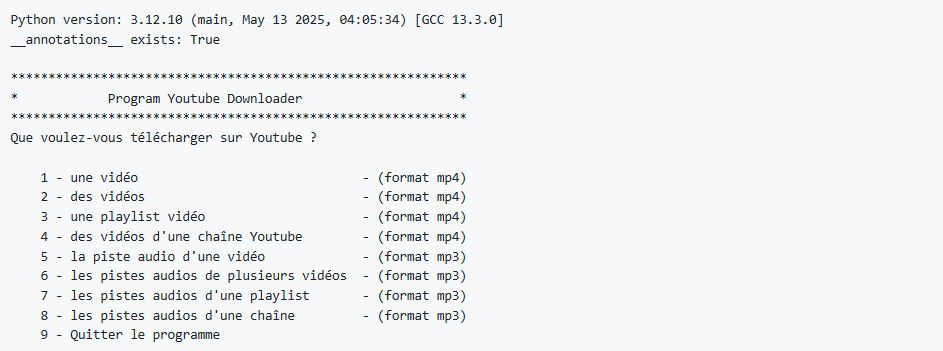

# Program Youtube Downloader

Ce projet permet de télécharger tous types de contenus YouTube grâce à la bibliothèque [pytubefix](https://pypi.org/project/pytubefix/). Vous pouvez récupérer des vidéos individuelles, des playlists entières ou même toutes les vidéos d’une chaîne, et choisir de n’enregistrer que la piste audio si besoin. Une interface en ligne de commande vous aide à sélectionner précisément ce que vous voulez et la qualité de sortie.

Principales fonctionnalités :

- Téléchargement de vidéos ou des pistes audio seules
- Support des playlists et des chaînes complètes
- Sélection de la qualité et du dossier de destination
- Interface en ligne de commande simplifiée

## Prérequis

- Python 3.10 ou plus récent
- Créez un environnement virtuel : `python -m venv .venv`
- Les dépendances listées dans `requirements.txt` :
  - `pytubefix` (pour récupérer correctement les flux YouTube)
  - `colorama` (affichage en couleur)
  - et les paquets utilisés pour l’emballage avec `pyinstaller`

Installez-les avec :

```bash
pip install -r requirements.txt
```

## Lancement

Exécutez simplement le script principal :

```bash
python main.py
```

Un menu s’affichera pour choisir le type de téléchargement (vidéo ou audio, playlist, chaîne, etc.). Les fichiers récupérés sont enregistrés dans le dossier spécifié par l’utilisateur.

Pour générer une version autonome du programme vous pouvez utiliser `pyinstaller` :

```bash
pyinstaller --onefile --add-data "mypy.ini;." --hidden-import "youtube_downloader" main.py
```

## Aperçu

Voici un exemple de lancement de l'application montrant les différentes options
du menu :

```
Python version: 3.12.10 (main, May 13 2025, 04:05:34) [GCC 13.3.0]
__annotations__ exists: True

*************************************************************
*            Program Youtube Downloader                     *
*************************************************************
Que voulez-vous télécharger sur Youtube ?

    1 - une vidéo                              - (format mp4)
    2 - des vidéos                             - (format mp4)
    3 - une playlist vidéo                     - (format mp4)
    4 - des vidéos d'une chaîne Youtube        - (format mp4)
    5 - la piste audio d'une vidéo             - (format mp3)
    6 - les pistes audios de plusieurs vidéos  - (format mp3)
    7 - les pistes audios d'une playlist       - (format mp3)
    8 - les pistes audios d'une chaîne         - (format mp3)
    9 - Quitter le programme
```
Image :



## Structure du projet

- `main.py` : point d’entrée du programme contenant la boucle de menu.
- `youtube_downloader.py` : toutes les fonctions de téléchargement (gestion des flux, choix de qualité, conversion en MP3, etc.).
- `requirements.txt` : liste des dépendances Python nécessaires.
- `mypy.ini` : configuration minimale pour `mypy`.

Ce projet est destiné à un usage personnel pour faciliter la récupération de contenu YouTube.

## Contribuer

Les contributions sont les bienvenues ! Vous pouvez ouvrir une *issue* pour signaler un problème ou demander une fonctionnalité. Pour proposer une correction ou une amélioration, créez une *pull request* depuis votre fork du dépôt.

Veuillez vous assurer que toute utilisation de cet outil respecte les Conditions d'utilisation de YouTube ainsi que les lois en vigueur dans votre pays. Les auteurs du projet déclinent toute responsabilité quant aux conséquences d'un usage inapproprié ou illégal.


