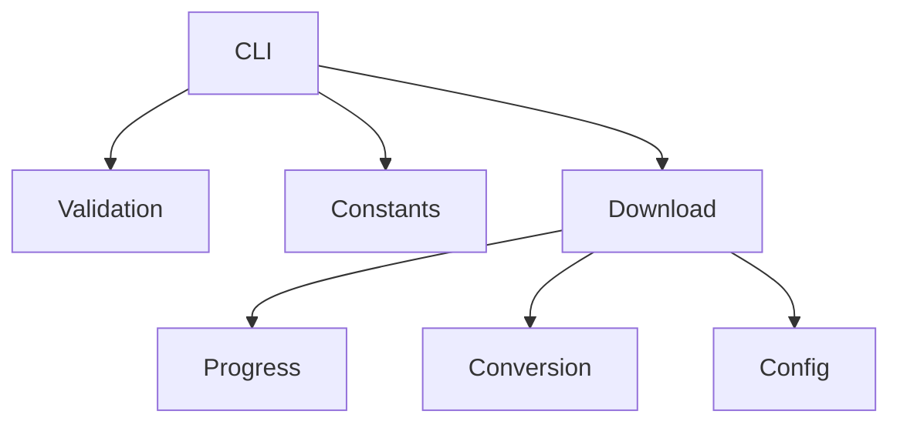

# Architecture du projet

Ce document décrit l’organisation des dossiers et les principaux composants de **Program Youtube Downloader**.

## Structure des dossiers

```text
Program_Youtube_Downloader/
├── program_youtube_downloader/  # code source principal
├── tests/                       # suite de tests unitaires
├── docs/                        # documentation du projet
├── assets/                      # images et ressources diverses
├── scripts/                     # scripts d’installation/maintenance
├── requirements.txt             # dépendances Python
└── pyproject.toml               # configuration du paquet
```

Le cœur de l’application se trouve dans le package `program_youtube_downloader` qui contient les modules Python utilisés par la CLI et les tests.

## Composants techniques

- **`program_youtube_downloader/main.py`** : point d’entrée de la CLI et gestion des arguments.
- **`downloader.py`** : récupération des flux YouTube et sauvegarde des fichiers.
- **`cli_utils.py`** : affichage des menus et validation des choix utilisateur.
- **`progress.py`** : barre de progression pendant les téléchargements.
- **`validators.py`** : vérification des URLs YouTube fournies.
- **`config.py`** : dataclass `DownloadOptions` pour paramétrer les opérations.
- **`constants.py`** : chaînes affichées dans le menu et URL de base.
- **`exceptions.py`** : classes d’erreur utilisées lors des validations et téléchargements.
- **`types.py`** : protocoles employés pour typer les objets YouTube.
- **`utils.py`** : utilitaires généraux (compte à rebours, nettoyage de l’écran).

### Convention de langue

Tous les messages affichés par la CLI et les journaux sont écrits en **français**. Les modules
`cli.py`, `cli_utils.py`, `downloader.py` et `progress.py` respectent cette règle
pour garantir une expérience cohérente.

La fonction `main()` peut recevoir un paramètre `cli_cls` pour instancier une
classe dérivée de `CLI`. Cela permet d’étendre ou remplacer l’interface en ligne
de commande sans modifier le reste du code.

## Schéma de fonctionnement



1. L’utilisateur lance `program-youtube-downloader` et choisit une action depuis le menu.
2. Les saisies (URL, dossier de destination, qualité) sont validées par les fonctions de `cli_utils` et `validators`.
3. `YoutubeDownloader` télécharge les flux grâce à `pytubefix` puis enregistre le fichier.
4. Si l’option audio est activée, le fichier MP4 est converti en MP3 via `conversion_mp4_in_mp3`.
5. Une barre de progression s’affiche durant le téléchargement et un message signale la fin de l’opération.

## Variables d'environnement

Certaines options peuvent être définies via le système pour éviter de les
passer à chaque exécution :

- `PYDL_MAX_WORKERS` pour contrôler le nombre de téléchargements parallèles ;
- `PYDL_OUTPUT_DIR` pour choisir le dossier de sortie par défaut ;
- `PYDL_AUDIO_ONLY` pour activer automatiquement le mode audio.
